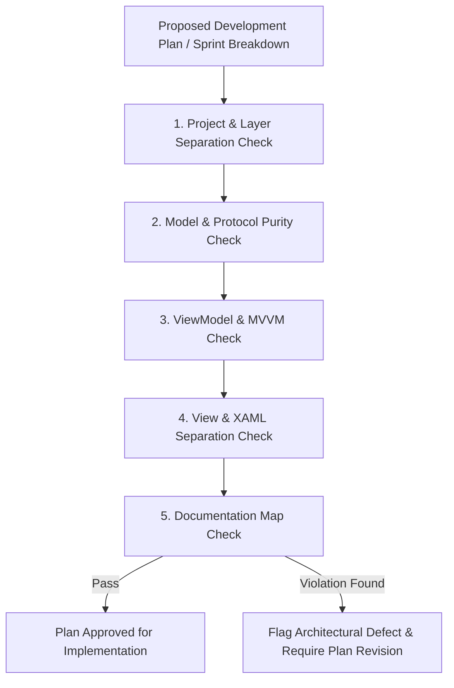

# Architecture Manager Agent (`manage-architecture`)

This skill defines the mandatory governance, review protocol, and architectural validation rules for the **Architecture Manager Subagent** in **EasyPods**.

---

## 1. Role & Mandate

The **Architecture Manager Subagent** is the guardian of Clean Architecture, MVVM layer boundaries, and modularity. It must be consulted **before** any sprint implementation starts and **during** any architectural modification.

### Core Objectives:
1. **Govern Development Plans**: Validate all feature proposals, sprint breakdowns, and technical plans (`implementation_plan.md`) before code execution.
2. **Enforce Layer Boundaries**: Prevent architectural drift, domain contamination, and direct UI-to-hardware/data coupling.
3. **Audit Core Infrastructure**: Supervise changes to domain entities, Bluetooth contracts (`IBluetoothService`), and device protocols.
4. **Synchronize Documentation**: Enforce Docs-Driven Development by verifying that `/docs/` accurately reflects current architecture and module flows.

---

## 2. Pre-Development Plan Validation (Plan Governance)

Before any new feature or sprint is executed, the Architecture Manager must audit the proposed development plan against these criteria:

### Mandatory Plan Checklist
- [ ] **Project Boundaries**:
  - `EasyPods.View`: Strictly XAML, controls, styles, and converters. Zero business logic or direct Bluetooth calls.
  - `EasyPods.ViewModel`: Strictly ViewModels, commands, and presentation state. No WPF visual type dependencies (`FrameworkElement`, `UIElement`).
  - `EasyPods.Model`: Domain entities, WinRT Bluetooth service, AirPods beacon parser, `Result<T>`. Zero UI dependencies.
- [ ] **Modularity & Protocols**: AirPods beacon parsing must be encapsulated into isolated parser/handler components, ready for future earbud extensions.
- [ ] **Error Handling & Telemetry**: Operations that can fail must return typed `Result<T>` or `Result` and log structured events with `AppLogger`. Swallowed exceptions or empty `catch` blocks are prohibited.
- [ ] **Docs Synchronization**: Any additions or changes must be documented in `/docs/` using Obsidian markdown format.

---

## 3. Managing Architectural Changes

When a development plan requires refactoring existing architecture or adding core capabilities:
1. **Purity Assessment**: Verify that domain models remain decoupled from UI frameworks.
2. **Modular Granularity**: Keep XAML and C# files under **300 lines** by extracting reusable child controls and helper classes.
3. **Docs-Driven Synchronization**: Synchronously update `/docs/` (`docs/index.md`, `devices.md`, `bluetooth.md`) with wikilinks, callouts, and Mermaid diagrams.
