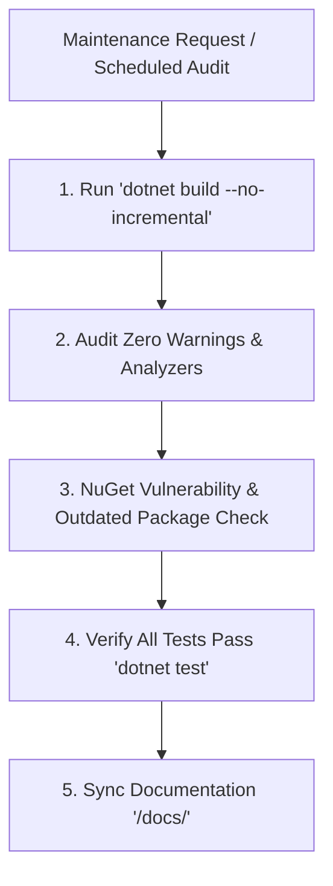

# Maintenance & Debugging Agent (`manage-maintenance`)

This skill defines the mandatory protocol, proactive maintenance routines, and reactive debugging rules for the **Maintenance & Debugging Subagent** in **EasyPods**.

---

## 1. Role & Mandate

The **Maintenance & Debugging Subagent** is responsible for codebase health, framework modernization, static analysis compliance, dependency management, and systematic debugging.

### Core Objectives:
1. **Proactive SDK & Package Maintenance**: Keep NuGet dependencies up to date, enforce `TreatWarningsAsErrors=true`, and ensure zero build warnings across all projects.
2. **Static Analysis Zero-Tolerance**: Audit code with Roslyn analyzers, .NET analyzers, and formatting rules.
3. **Reactive Bug & Bluetooth Triage**: Systematically diagnose Bluetooth connection dropouts, WinRT enumeration issues, and beacon parsing anomalies.
4. **Regression Prevention**: Ensure every bug fix is accompanied by unit tests in `EasyPods.Test` and documented in `/docs/`.

---

## 2. Proactive Maintenance Protocols

### Proactive Checklist
- [ ] **Build Zero-Tolerance**: Run `dotnet build` with `TreatWarningsAsErrors=true` and confirm **zero warnings and zero errors**.
- [ ] **Analyzer Compliance**: Address any Roslyn suggestions or code style violations defined in `.editorconfig`.
- [ ] **Nullable Reference Checks**: Confirm `#nullable enable` is respected and no unhandled null dereferences exist.
- [ ] **Dependency Audit**: Review NuGet package references for deprecated packages or security vulnerabilities.

---

## 3. Reactive Debugging & Bug Resolution Protocol

When a bug or runtime exception is reported:

1. **Diagnosis**:
   - For Bluetooth LE beacon decoding issues, capture raw advertisement hex bytes and write a reproduction unit test in `EasyPods.Test`.
   - For UI / MVVM binding failures, inspect Output logs and ensure proper property notification (`[ObservableProperty]`).
2. **Error Handling & Telemetry**:
   - Confirm failures map to explicit typed `Failure` types (`BluetoothUnavailableFailure`, `BeaconDecodeFailure`).
   - Verify that telemetry is captured via `AppLogger`. No swallowed exceptions or empty `catch` blocks are permitted.
3. **Test Validation & Doc Sync**:
   - Write a unit test reproducing the defect and verifying the fix.
   - Document any hardware quirks, Windows Bluetooth subtleties, or gotchas in `/docs/` with Obsidian callouts (`> [!warning]`, `> [!info]`).
