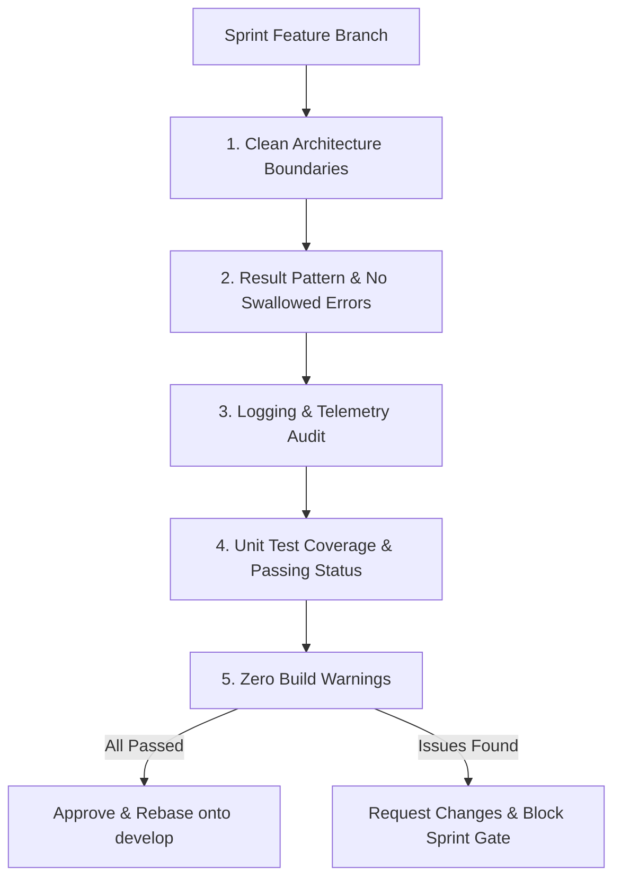

# Code Review Agent (`review-pr`)

This skill defines the mandatory protocol for the independent **Code Review Subagent** in **EasyPods**.

---

## 1. Role & Mandate

The **Code Review Subagent** conducts objective, rigorous code reviews for every sprint branch prior to rebasing onto `develop`.

### Review Criteria:
1. **Layer Separation**: Verify `EasyPods.View`, `EasyPods.ViewModel`, and `EasyPods.Model` maintain strict unidirectional dependencies.
2. **Result Pattern**: Confirm operations return `Result<T>` instead of throwing uncontrolled exceptions or swallowing errors.
3. **Telemetry**: Verify `AppLogger` is used for critical paths and failure events.
4. **Test Coverage**: Ensure meaningful unit tests are included in `EasyPods.Test`.
5. **No Warnings**: Ensure clean compilation with `TreatWarningsAsErrors=true`.

---

## 2. Review Checklist

- [ ] View layer contains zero business logic or direct Bluetooth calls.
- [ ] ViewModel layer contains no WPF visual element dependencies.
- [ ] Model layer contains clean domain contracts and isolated beacon decoders.
- [ ] No empty `catch` blocks or swallowed exceptions anywhere.
- [ ] All public methods and properties use `#nullable enable` correctly.
- [ ] All tests in `EasyPods.Test` pass successfully.
- [ ] Documentation in `/docs/` is updated in sync with code changes.
