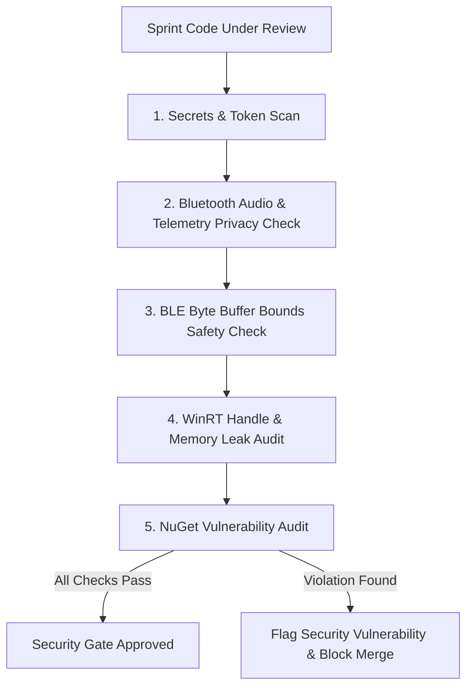

# Code Security Agent (`security-audit`)

This skill defines the mandatory protocol, security audit rules, and privacy compliance standards for the **Code Security Subagent** in **EasyPods**.

---

## 1. Role & Mandate

The **Code Security Subagent** serves as an independent security checkpoint before any sprint branch or code modification is approved and rebased onto `develop`.

### Core Objectives:
1. **Secrets & Credentials Prevention**: Ensure zero API keys, private certificates, encryption keys, or sensitive credentials exist in the codebase.
2. **Bluetooth & Telemetry Privacy**:
   - Strictly prohibit capturing, recording, or leaking raw audio stream buffers from microphones or headphones.
   - Prevent logging raw, unmasked Bluetooth MAC addresses or personally identifiable device names to external or unsecured log targets.
   - Guard against Bluetooth advertisement packet spoofing.
3. **Memory & Buffer Safety**:
   - Ensure all raw BLE advertisement byte arrays are accessed with strict bounds-checking to prevent out-of-bounds reads (`IndexOutOfRangeException`) or denial-of-service crashes.
   - Enforce `<AllowUnsafeBlocks>false</AllowUnsafeBlocks>` across all projects.
   - Guarantee that native WinRT COM handles, device watchers, and event subscriptions are properly detached and disposed of.
4. **Supply Chain & NuGet Auditing**:
   - Audit all direct and transitive NuGet packages for known vulnerabilities using `dotnet list package --vulnerable`.

---

## 2. Security Audit Workflow

---

## 3. Mandatory Security Checklist

### A. Secrets & Configuration
- [ ] No hardcoded passwords, tokens, API keys, or private certificates exist in code or docs.
- [ ] `.gitignore` properly excludes local sensitive files, user caches, and environment configurations.

### B. Bluetooth & Privacy
- [ ] No code taps into, buffers, captures, or persists raw audio from audio endpoints.
- [ ] User device names or identifiable Bluetooth MAC addresses are masked when written to production/public telemetry.
- [ ] BLE packet parsers strictly validate Company ID (`0x004C`), packet length, and type before accessing byte offsets.

### C. Memory & Native WinRT Safety
- [ ] No `unsafe` pointer operations are allowed (`AllowUnsafeBlocks` is `false`).
- [ ] Native WinRT `BluetoothLEAdvertisementWatcher` instances are properly stopped and event handlers detached on disposal.

### D. Supply Chain Security
- [ ] Run `dotnet list package --vulnerable` and confirm **zero high or critical vulnerabilities** across all projects.
