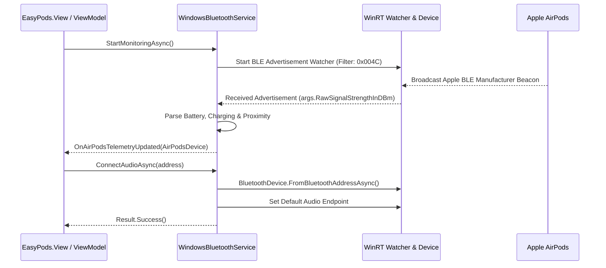

# Windows Bluetooth Architecture & WinRT Integration

This document outlines how EasyPods interacts with the Windows Bluetooth subsystem via Windows Runtime (WinRT) APIs.

---

## 1. WinRT Bluetooth APIs

EasyPods utilizes native Windows 10/11 WinRT APIs without external COM dependencies:
- **`Windows.Devices.Bluetooth.BluetoothDevice`**: Classic Bluetooth connection, pairing status, audio device profiles.
- **`Windows.Devices.Bluetooth.Advertisement.BluetoothLEAdvertisementWatcher`**: Low-latency background BLE advertisement packet receiver.
- **`Windows.Devices.Radios.Radio`**: Monitoring adapter power state (On, Off, Disabled).
- **`Windows.Media.Devices.MediaDevice`**: Monitoring and switching default multimedia audio playback endpoints.

---

## 2. Connection & Telemetry Flow

---

## 3. BluetoothLEAdvertisementWatcher Implementation

Configured in `EasyPods.Model.Bluetooth.WindowsBluetoothService`:
- **Scanning Mode**: `BluetoothLEScanningMode.Active` (requests scan response packets).
- **Company ID Filter**: Filtered at the Windows kernel driver level for Apple Inc. (`0x004C`) to minimize CPU wakeups.
- **Signal Strength**: Extracts `RawSignalStrengthInDBm` (RSSI) and maps to proximity states (`Excellent`, `Good`, `Fair`, `Weak`).
- **Buffer Safety**: Uses `Windows.Storage.Streams.DataReader` to copy payload bytes safely with bounds protection.
- **Resource Lifecycle**: Implements `IDisposable` and `IAsyncDisposable` to stop watcher threads and unregister native WinRT event delegates cleanly.
