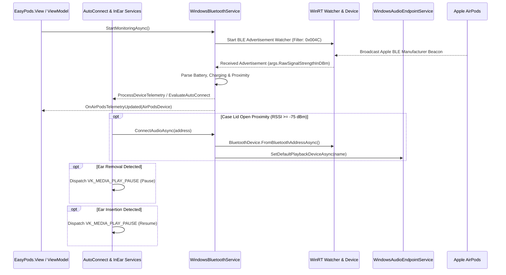

# Windows Bluetooth Architecture & Hardware Automations

This document outlines how EasyPods interacts with the Windows Bluetooth subsystem via Windows Runtime (WinRT) APIs and manages active hardware control.

---

## 1. WinRT Bluetooth & Audio APIs

EasyPods utilizes native Windows 10/11 WinRT APIs without external COM dependencies:
- **`Windows.Devices.Bluetooth.BluetoothDevice`**: Classic Bluetooth connection, pairing status, audio device profiles, RFCOMM uncached handshakes.
- **`Windows.Devices.Bluetooth.Advertisement.BluetoothLEAdvertisementWatcher`**: Low-latency background BLE advertisement packet sniffer.
- **`Windows.Devices.Radios.Radio`**: Monitoring adapter power state (On, Off, Disabled).
- **`Windows.Media.Devices.MediaDevice`**: Monitoring and switching default multimedia and communications audio playback endpoints.

---

## 2. Connection & Telemetry Flow

---

## 3. Hardware Automations (`EasyPods.Model.Hardware`)

### A. In-Ear Auto-Pause & Auto-Resume (`WindowsInEarAutomationService`)
- Listens to real-time optical/capacitive skin sensor changes (`LeftInEar`, `RightInEar`).
- Automatically dispatches Windows system media key `VK_MEDIA_PLAY_PAUSE` (`0xB3`) via P/Invoke `keybd_event`.
- Features a **400ms debounce hysteresis** to prevent stutter when adjusting pods in the ear.
- Tracks `HasAutoPaused` so it only auto-resumes if EasyPods originally paused it.

### B. Proximity Case Lid Auto-Connect (`WindowsAutoConnectService`)
- Triggers when `IsCaseLidOpen == true` within proximity threshold (default `-75 dBm`).
- Connects paired AirPods before they are even inserted into the ears.
- Enforces a **10-second cooldown** to prevent duplicate connection requests.

### C. Audio Endpoint Management (`WindowsAudioEndpointService`)
- Uses WinRT `MediaDevice.GetAudioRenderSelector()` and `DeviceInformation.FindAllAsync()`.
- Automatically sets default playback device upon connection and restores the previous default speaker upon disconnect.

### D. Listening Mode & Noise Control (`WindowsNoiseControlService`)
- Enforces model-aware noise control rules:
  - `ActiveNoiseCancellation` and `Transparency`: AirPods Pro 1/2, AirPods Max, AirPods 4 ANC.
  - `Adaptive Audio`: AirPods Pro 2, AirPods 4 ANC.
