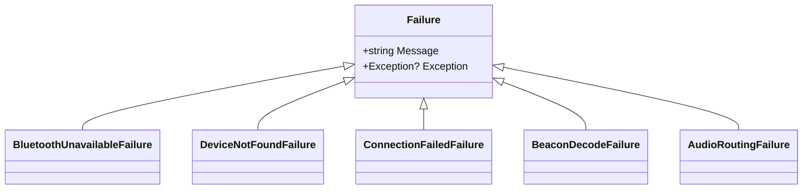

# Core Domain & Error Handling Architecture

This document specifies the core domain models, typed `Result<T>` error handling pattern, and telemetry standards in `EasyPods.Model`.

---

## 1. Domain Entities

### `AirPodsDevice`
Represents an identified Apple AirPods device:
- `Address`: Bluetooth MAC Address (`ulong` / formatted hex string)
- `Name`: Friendly device name (e.g., "Guy's AirPods Pro")
- `Model`: `AirPodsModelType` (AirPods1, AirPods2, AirPods3, AirPods4, AirPodsPro1, AirPodsPro2, AirPodsMax)
- `ConnectionState`: `Disconnected`, `Connecting`, `Connected`, `Disconnecting`
- `Battery`: `BatteryInfo` (Left, Right, Case battery % and charging states)
- `InEarStatus`: `InEarStatus` (LeftInEar, RightInEar)

### `BatteryInfo` (Immutable Record)
```csharp
public sealed record BatteryInfo(
    int? LeftPodLevel,
    bool LeftCharging,
    int? RightPodLevel,
    bool RightCharging,
    int? CaseLevel,
    bool CaseCharging,
    DateTimeOffset LastUpdatedUtc
);
```

---

## 2. Typed `Result<T>` Pattern

Exceptions are strictly prohibited for control flow across layer boundaries. All operations that can fail return `Result<T>` or `Result`.

```csharp
public class Result<T>
{
    public bool IsSuccess { get; }
    public T? Value { get; }
    public Failure? Error { get; }
    ...
}
```

### Failure Hierarchy


---

## 3. Telemetry & Logging (`AppLogger` via NLog)

Centralized structured logging powered by **NLog** with non-blocking asynchronous targets:
- **Async Rolling File Target**: `%LOCALAPPDATA%\EasyPods\Logs\easypods-${shortdate}.log`
  - Automated daily rotation and 7-day retention in `archives/`.
  - Non-blocking async queue ensures Bluetooth LE advertisement processing and UI threads never stall.
- **Debugger Target**: Streams colored log events directly to Visual Studio / IDE Output.
- **Convenient Static Facade**:
  - `AppLogger.Debug(msg, tag)`
  - `AppLogger.Info(msg, tag)`
  - `AppLogger.Warn(msg, tag)` (or `AppLogger.Warning`)
  - `AppLogger.Error(msg, exception, tag)`
  - `AppLogger.Fatal(msg, exception, tag)` (used for unhandled crashes in `App.xaml.cs`)
- Swallowed exceptions and unlogged errors are strictly prohibited across all layers.
