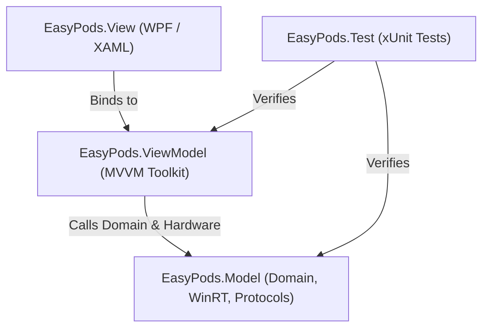

# EasyPods — System Map & Documentation Hub

Welcome to the **EasyPods** technical documentation. EasyPods is a modular Windows desktop application engineered with **WPF (.NET 8.0)** to seamlessly manage, monitor, and assist with Bluetooth headphone connections, beginning with **Apple AirPods** (left/right pod battery telemetry, charging case status, in-ear detection, and instant reconnect).

---

## 1. Architectural Blueprint (Layered MVVM)

The solution is divided into four strictly decoupled projects:

| Project | Responsibility | Dependencies |
| :--- | :--- | :--- |
| **`[[ui\|EasyPods.View]]`** | Pure XAML Presentation layer, Fluent dark/light themes, custom battery gauges, and system tray flyout. | `EasyPods.ViewModel`, `EasyPods.Model` |
| **`[[core\|EasyPods.ViewModel]]`** | ViewModels, presentation state machine, commands, notification dispatching. Decoupled from WPF UI classes. | `EasyPods.Model`, `CommunityToolkit.Mvvm` |
| **`[[bluetooth\|EasyPods.Model]]`** | Domain entities, WinRT Bluetooth LE advertisement watchers, Apple BLE beacon parser, typed `Result<T>` error hierarchy. | WinRT APIs, Windows SDK |
| **`EasyPods.Test`** | Unit and integration test suite covering beacon parsing, result contracts, and ViewModels. | `EasyPods.Model`, `EasyPods.ViewModel`, xUnit |

---

## 2. Documentation Map

- **[[core|Core Domain & Error Handling]]**: `AirPodsDevice` model, `BatteryInfo`, `Result<T>` pattern, structured logging.
- **[[bluetooth|Windows Bluetooth Architecture]]**: WinRT Bluetooth APIs, BLE advertisement watcher, device pairing, audio endpoints.
- **[[devices|AirPods Beacon & Protocol Decoding]]**: Apple BLE manufacturer data format (Company ID `0x004C`), battery decoding, in-ear detection.
- **[[ui|WPF UI & System Tray Shell]]**: Fluent styling, battery gauges, system tray flyout, and theme switching.
- **[[workflow|Workflow & Multi-Agent Governance]]**: GitFlow branch lifecycle, sprint execution gates, docs synchronization.
