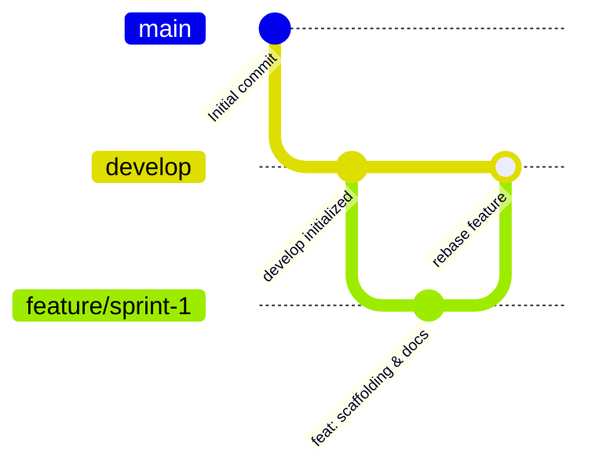

# Multi-Agent Workflow & Sprint Governance

This document describes the sprint execution protocol, subagent responsibilities, and Docs-Driven Development rules ported from ShoppingExplore.

---

## 1. Branching & GitFlow Policy

- **`main`**: Protected branch. Merging into `main` is strictly reserved for the user or explicit instruction.
- **`develop`**: Integration branch for completed and audited sprints.
- **`feature/<name>-sprint-<number>`**: Working branch for each sprint. Must be rebased onto `develop` and deleted upon passing review.

---

## 2. Multi-Agent Governance Roles

1. **Architecture Manager (`manage-architecture`)**: Audits plans, validates project boundaries (`EasyPods.View`, `EasyPods.ViewModel`, `EasyPods.Model`, `EasyPods.Test`), ensures domain purity and docs sync.
2. **Code Security Subagent (`security-audit`)**: Audits secrets, Bluetooth telemetry privacy, raw buffer bounds safety, and NuGet vulnerabilities.
3. **Maintenance & Debugging (`manage-maintenance`)**: Manages SDK/NuGet dependencies, monitors build warnings (`TreatWarningsAsErrors`), diagnoses runtime defects.
4. **Code Reviewer (`review-pr`)**: Audits sprint PRs for typed error handling (`Result<T>`), structured telemetry (`AppLogger`), layer purity, and tests.
5. **Testing Agent**: Verifies unit and integration test coverage.

---

## 3. Sprint Stop Gate

At the completion of every sprint:
1. Automated tests must pass with 0 errors and 0 warnings.
2. Code review audit must pass.
3. Feature branch is rebased onto `develop` and deleted.
4. Agent MUST STOP, report the sprint summary to the user, and wait for approval before beginning the next sprint.
